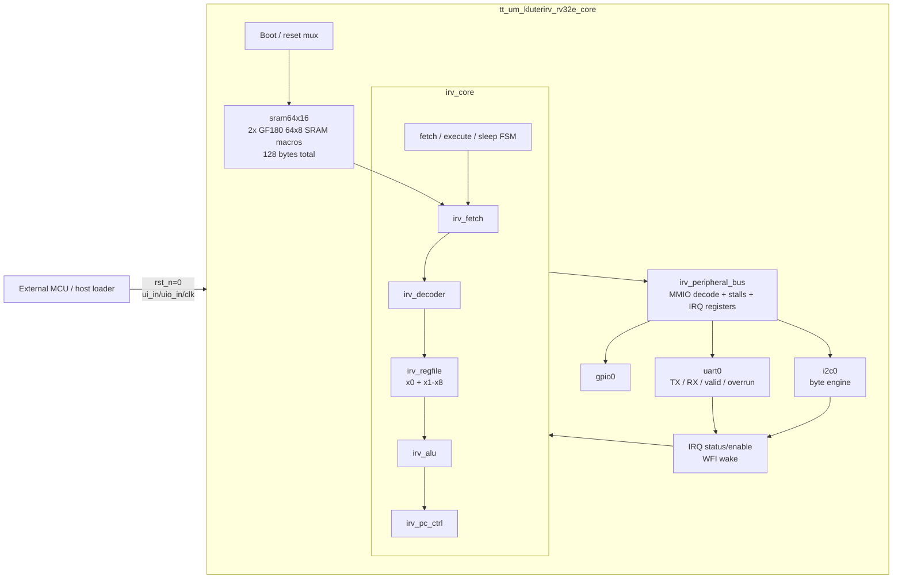

# INNOVA IRV ULP RISC-V TinyTapeout SoC

This repository contains a compact RISC-V micro-SoC prototype for TinyTapeout / GF180. The goal is to explore ultra-low-power architectural techniques in a constrained ASIC environment: small SRAM-based program memory, compact datapaths, event-driven execution, WFI sleep, interrupt wake-up, and simple memory-mapped peripherals.

The current prototype is intentionally small and area-aware. It is not a full RV32I implementation; it is a practical test vehicle for evaluating how much useful RISC-V functionality can be integrated while keeping GDS closure stable.

## High-level architecture



A more detailed architecture draft is kept in [`docs/architecture.md`](docs/architecture.md).

## Implemented blocks

| Area | Status |
|---|---|
| CPU core | Compact RV32E-like core with fetch/decode/regfile/ALU/PC modules |
| Register file | `x0` hardwired to zero, physical registers `x1` to `x8` |
| Memory | 128-byte instruction SRAM using two GF180 `64x8` macros through `sram64x16` |
| Boot | External parallel SRAM programming while `rst_n = 0` |
| GPIO | 8-bit memory-mapped output register |
| UART | TX, RX, RX valid, read-clear, RX overrun |
| I2C | Divider, control, data, status, byte write/read engine, ACK/NACK status |
| IRQ | `WFI`, sleep state, fixed vector `0x40`, `IRQ_STATUS`, `IRQ_ENABLE`, return through `x1` + `JALR` |
| Tests | Split cocotb regression under one entry point, RTL and GLS-aware coverage |
| Physical flow | TinyTapeout GF180 / LibreLane flow with SRAM macro integration |

## Memory map

| Address | Name | Direction | Description |
|---:|---|---|---|
| `0x1000_0000` | `GPIO0_OUT` | W | GPIO output register, visible on `uo_out` in run mode |
| `0x1000_0004` | `UART0_TX` | W | UART transmit data |
| `0x1000_0008` | `UART0_STATUS` | R | bit 0 `tx_busy`, bit 1 `rx_valid`, bit 2 `rx_overrun` |
| `0x1000_000C` | `UART0_RX` | R | UART RX data; reading clears `rx_valid` |
| `0x1000_0010` | `I2C0_CTRL` | W | I2C command/control register |
| `0x1000_0014` | `I2C0_DATA` | R/W | I2C transmit/receive data |
| `0x1000_0018` | `I2C0_STATUS` | R | I2C status: busy, done, ACK/NACK, RX valid, line state |
| `0x1000_001C` | `I2C0_DIV` | W | I2C clock divider |
| `0x1000_0020` | `IRQ_STATUS` | R | bit 0 UART RX valid, bit 1 UART RX overrun, bit 2 I2C done |
| `0x1000_0024` | `IRQ_ENABLE` | R/W | IRQ source mask |

## Supported instruction subset

| Class | Instructions |
|---|---|
| System / control | `EBREAK`, `WFI` |
| U-type | `LUI` |
| I-type ALU | `ADDI`, `XORI`, `ORI`, `ANDI`, `SLTI`, `SLTIU`, `SLLI`, `SRLI`, `SRAI` |
| R-type ALU | `ADD`, `SUB`, `XOR`, `OR`, `AND`, `SLT`, `SLTU` |
| Load/store | `LW`, `SW` for MMIO access |
| Branches | `BEQ`, `BNE`, `BLT`, `BGE`, `BLTU`, `BGEU` |
| Jumps | `JAL`, `JALR` |

## Interrupt and low-power model

The interrupt model is intentionally minimal and area-aware:

1. Firmware enables interrupt sources through `IRQ_ENABLE`.
2. The CPU executes `WFI`.
3. The core enters a low-activity sleep state.
4. If `irq_status & irq_enable` is non-zero, the core wakes.
5. On wake-up, the core writes `x1 = PC + 4` and jumps to fixed vector `0x0000_0040`.
6. The handler can return with `JALR x0, x1, 0`.

This is not a full privileged RISC-V interrupt implementation. It is a compact event/wake mechanism intended for ULP experimentation.

## Boot and programming model

The ASIC currently uses an external parallel loader instead of an internal UART bootloader. During reset, SRAM can be programmed through `ui_in`, `uio_in`, and `clk`. When reset is released, the core starts at `PC = 0`.

Documentation:

- [`docs/parallel_bootloader.md`](docs/parallel_bootloader.md)
- [`tools/make_parallel_image.py`](tools/make_parallel_image.py)
- [`tools/external_loader/README.md`](tools/external_loader/README.md)

## Test strategy

The SRAM is limited to 128 bytes, so each cocotb subtest loads a separate small program. The suite uses one `@cocotb.test()` entry point and runs several logical subtests sequentially.

Covered areas:

- core ALU and comparison instructions,
- branches and jumps,
- GPIO MMIO,
- UART TX,
- UART RX functionality in RTL,
- I2C ACK/NACK transactions,
- WFI / IRQ wake-up and return,
- I2C done interrupt.

Gate-level simulation intentionally skips asynchronous UART RX stimulus subtests because that stimulus can introduce X-pessimistic behavior in GLS. UART RX behavior remains covered in RTL; GLS focuses on synchronous paths and stable peripheral interactions.

## Physical implementation notes

The design uses two SRAM macros placed near the sides of the tile. Routing is sensitive to:

- SRAM macro placement and orientation,
- barrel shifter implementation,
- register file size,
- global/detailed placement padding,
- channel availability between memory macros and standard-cell logic.

Current area/routing work focuses on keeping the design routable while adding ISA functionality. Important area-aware decisions include:

- JALR target computation reuses the ALU adder path,
- comparative branches reuse ALU comparison paths,
- MMIO load/store address generation shares one address adder,
- shift operations use a shared configurable barrel shifter rather than independent shifters.

## Repository structure

```text
src/
  top/                  TinyTapeout top-level wrapper
  core/                 CPU core modules
  mem/                  SRAM wrapper
  soc/                  MMIO peripheral bus
  peripherals/          GPIO, UART, I2C
  macro_blackboxes/     SRAM simulation/blackbox wrapper

test/
  test.py               cocotb regression
  tb.v                  RTL/GL testbench wrapper

docs/
  architecture.md       editable architecture draft
  parallel_bootloader.md

tools/
  make_parallel_image.py
  external_loader/
```

## Running tests

RTL simulation:

```bash
make -C test clean
make -C test
```

Gate-level simulation is normally run by the TinyTapeout GitHub workflow after GDS generation.

## Current priorities

1. Improve physical closure around SRAM placement/orientation.
2. Validate shared shifter implementation through RTL/GDS/GLS.
3. Continue measuring area, wirelength, vias, buffers, and DRC after each feature.
4. Expand documentation and architecture diagrams.
5. Add further features only if routing remains stable.
